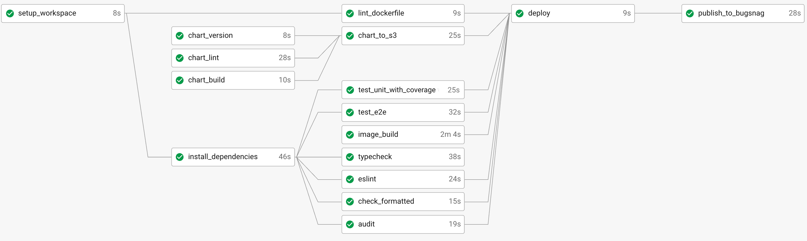

[](https://procoretech.slack.com/archives/C022L0R5BGQ)
[](https://procoretech.atlassian.net/browse/APPINF)
[](https://app.circleci.com/pipelines/github/procore/simple-backend-nest-service)

- Service Owners: [#service-templates](https://procoretech.slack.com/archives/C022L0R5BGQ)
- [Report an issue](https://procoretech.atlassian.net/secure/RapidBoard.jspa?rapidView=1022)
- [Contributing](./CONTRIBUTING.md)
- Container images on [Quay](https://quay.io/repository/procoredevops/simple-backend-nest-service)
- [Tugboat application CRD](https://github.com/procore/tugboat/blob/master/.chart/templates/simple-backend-nest-service-app.yaml)
- [Argo CD Workflows](https://argocd.us00.ops.procoretech.com/applications)
- [DataDog Dashboard](https://app.datadoghq.com/dashboard/vss-h75-cmb/simple-backend-nest-service)
- [New Relic Dashboard](https://one.nr/0eqwy8vxeQn)
- [Sumo Logic Logs](https://service.us2.sumologic.com/ui/#/search/create?id=pZARtnuODBs9yHSUrekxAQ6WkwRixsboFgGQLr39)
- [Bugsnag](https://app.bugsnag.com/procore/simple-backend-service/timeline?filters[event.since][0][type]=eq&filters[event.since][0][value]=1d)


An exemplar simple backend service written in TypeScript and [Nest.js](https://github.com/nestjs/nest)

**Topics**

- [Overview](#overview)
- [As a Service Template](#as-a-service-template)
  - [Using in an Existing Service](#using-in-an-existing-service)
- [Development](#development)
  - [Running Locally](#running-locally)
    - [Installation](#installation)
    - [Viewing Documentation](#viewing-documentation)
    - [Other Commands](#other-commands)
  - [Running with Kubernetes (recommended)](#running-with-kubernetes-recommended)
    - [Reporting Telemetry Remotely](#reporting-telemetry-remotely)
  - [Running with Docker](#running-with-docker)
  - [Helm Chart Tugboat Compatibility](#helm-chart-tugboat-compatibility)
  - [Pre-Commit Hooks](#pre-commit-hooks)
  - [Releasing](#releasing)
    - [CircleCI](#circleci)

# Overview

This is a simple, stateless backend service to demonstrate best practices outlined in
Procore's [Service Creation Guide]. The service has a few simple endpoints to demonstrate best
practices for creating a new service at Procore.

This Github Repository was created via a P&T Operations ticket, which is documented
[here](https://procoretech.atlassian.net/wiki/spaces/CSE/pages/1595474819/New+Project+Provisioning+Ticket).

# As a Service Template

This repository is a functional production service, but is also intended to be
easily reused as a template for a new NestJS service. After cloning the repo,
you should

- update references to `simple-backend-nest-service` to match your service's name
- delete `src/demo` and references to the `DemoModule`
- delete additional example tests `test/e2e/demo`
- update `CODEOWNERS`
- delete any explanatory comments that are no longer helpful
- update the frontmatter links in this `README`; delete or replace the rest of the `README`
- update or delete `CONTRIBUTING`
- update or replace `test/perf/my-load-test.js` and `test/perf/config.localhost.json` to apply to your service.

It is inadvisable to make adjustments to the subcharts such as
[`charts/stateless-http-service`](./.charts/simple-backend-nest-service/charts/stateless-http-service). If changes are needed, please pass that feedback on to
[#service-templates](https://procoretech.slack.com/archives/C022L0R5BGQ)
or opening a PR into [app-charts](https://github.com/procore/app-charts/blob/main/CONTRIBUTING.md) to upstream those changes so that future teams can benefit from your improvements.

## Using in an Existing Service

The reusable business logic here is almost entirely contained in
the package `@procore/foundations-nest`. Similarly, `.charts/simple-backend-nest-service/charts/stateless-http-service`
contains a general, parametrized, reusable Helm chart for launching a stateless
HTTP service that is shared at Procore and should not be modified.

In the near future, `.charts/simple-backend-nest-service/charts/stateless-http-service`
will be packaged up as a library and distributed for re-use. For now, you'll need to copy and paste it into your
existing service. It is inadvisable to make adjustments to the subcharts files, if changes are needed, please consider passing that feedback on to
[#service-templates](https://procoretech.slack.com/archives/C022L0R5BGQ)
or opening a PR into [app-charts](https://github.com/procore/app-charts/blob/main/CONTRIBUTING.md) to upstream those changes, so that it will be easy for you to
drop in those libraries once they are released.

# Development

_Note:_ For more information about contributing to this template, see [CONTRIBUTING](./CONTRIBUTING.md)

## Running Locally

### Installation

Supported Environment variables are documented in `env.sample`. Copy it to `.env` and update accordingly

```sh
cp env.sample .env
```

The project is configured to use [asdf](https://asdf-vm.com/) to manage node, and `asdf install` will install the right version.

To install `@procore` internal packages you will need an `NPM_TOKEN` provisioned. If you do not already have NPM access, request access through the P&T Marketplace via Okta. Then provision a token yourself by running

```bash
$ npm login
$ npm token create --read-only
```

Once you have an `NPM_TOKEN`, copy `npmrc.sample` to `.npmrc`

```sh
cp npmrc.sample .npmrc
```

Replace the text `${NPM_TOKEN}` in your new .npmrc file. This will enable local development using Skaffold.
Do not export your NPM_TOKEN as an environment variable.

Once `node` and `npm` are installed, run

```bash
$ ./bin/setup
$ npm run start:dev
```

With that, the app should be available at [http://localhost:3000](http://localhost:3000)!

### Viewing Documentation

The documentation of this project is geared at calling out the important details of service
creation, and the docs can be viewed locally after cloning the repository:

```bash
npm install
npm run doc:server
```

### Other Commands

See [`package.json`](tree/main/package.json) for a full list of available `run`
commands. Some more common commands are:

```bash
# run in debug mode
$ npm run start:debug

# run in production mode
$ npm run start:prod

# run tests on file change
$ npm run test:watch

# report test coverage
$ npm run test:cov

# run e2e tests
$ npm run test:e2e
```

## Running with Kubernetes (recommended)

We currently use `kind` and `skaffold` for local development that depends on
testing /re-building container images. After installing both,
set up global versions for them if using `asdf` or some other manager, ensure your kubernetes cluster is running,
then run

```bash
skaffold dev --port-forward
```

- If you run into a "Build Failed. No push access to specified image repository. Check your `--default-repo` value or try `docker login`." error: Run `kind get clusters`. If `No kind clusters found.` is returned, run `kind create cluster`. You can confirm this worked by checking that there is a kind cluster in ~/.kube/config.

### Reporting Telemetry Remotely

Credentials for remote telemetry services are configured with environment
variables. See [`env.sample`](tree/main/env.sample) for details of the available
settings.

In Kubernetes, these environment variables will be provided to the container
through `ConfigMap`s and `Secret`s. See [`deployment.yaml`](tree/main/.charts/simple-backend-nest-service/charts/stateless-http-service/templates/deployment.yaml) for details.

You can provision a `Secret` containing sensitive keys using

```bash
kubectl create secret generic \
  simple-backend-nest-service-secret \
  -n simple-backend-nest-service \
  --from-literal=new_relic_license_key=$NEW_RELIC_LICENSE_KEY \
  --from-literal=bugsnag_api_key=$BUGSNAG_API_KEY
```

To create more load on the the sample dashboards, visit [simple-backend-nest-service/](https://simple-backend-nest-service.application.staging.procoretech-qa.com/) or [simple-backend-nest-service/slow](https://simple-backend-nest-service.application.staging.procoretech-qa.com/slow) and trigger an exception reported to bugsnag here: [simple-backend-nest-service/exception](https://simple-backend-nest-service.application.staging.procoretech-qa.com/exception)

## Running with Docker

The AppInf Team prefers Skaffold, but if you want to use docker
to build and run the app in a Docker container run

```bash
DOCKER_BUILDKIT=1
docker build . -t simple-backend-nest-service
docker run --env-file .env -p 3000:3000 simple-backend-nest-service
```

## Helm Chart Tugboat Compatibility

There are several chart features that allow the Tugboat Application to install this service's helm chart. These are commented in the chart files where applicable. These features consist of annotations and labels that Tugboat uses for its UI and secrets management system. Tugboat "injected" template values come from the `staticValues` section of [Tugboat application CRD](https://github.com/procore/tugboat/blob/master/.chart/templates/simple-backend-nest-service-app.yaml) created for the simple-backend-nest-service.  You can read more about this in the [Tugboat Help Center](https://procoretech.atlassian.net/wiki/spaces/CSE/pages/803832695/Tugboat+Help+Center) documents related to [Preparing Your Helm Chart for Tugboat](https://procoretech.atlassian.net/wiki/spaces/CSE/pages/1920467305/Preparing+Helm+Chart+for+Deploy).

## Pre-Commit Hooks

Pre-commit hooks are configured to run the following operations against changed files through `husky` and `lint-staged`:

- `eslint` - lints and fixes JS and TS code
- `prettier` - formats YML, MD, JSON, JS and TS files
- `tsc` - type-checks TS files

To bypass these checks for any reason during development, run

```
git commit --no-verify
```

## Releasing

This application will primarily be deployed as a [Docker](https://www.docker.com/) container,
from our [Quay.io] repository. Successful builds on `main` automatically trigger
a deploy of the changes.

### CircleCI



The following stages have been configured:

- `setup_workspace` - Pulls the code and prepares the workspace
- `install_dependencies` - installs dependencies and caches
  node_modules for future builds
- `lint_dockerfile` - lints the [Dockerfile]
- `audit` - scans Node dependencies for security vulnerabilities
- `test_unit_with_coverage` - Runs unit tests and unit test coverage report with thresholds
  - Coverage report stored as artifacts
- `test_e2e` - Runs e2e tests
- `image_build` - Builds the docker image and pushes to [Quay.io]
  - builds on `main` branch create and push a `latest` tag
- `check_formatted` - Ensures code is formatted according to `prettier` rules
- `eslint` - lints the TS code
- `chart_lint` - runs `helm lint` for each stage
- `chart_build` - `helm package`s an archive for the default configuration
- `chart_version` - persists metadata about the chart, for use in future steps
- `chart_to_s3` - if (and only if) the chart version has changed, release the packaged chart to S3
- `deploy` - if all other checks pass, sends POST request to Sherpa to deploy from `releases` branch
- `publish_to_bugsnag` - publishes build artifacts and source maps to [Bugsnag] after a successful deploy

See the [CircleCI config](./.circleci/config.yml) for details.

The [Dockerfile] is setup to use a [multi-stage
build](https://docs.docker.com/develop/develop-images/multistage-build/) to minimize the final
image size and attack surface area. More details can be found in the file.

[bugsnag]: https://app.bugsnag.com/procore/simple-backend-service/errors
[service creation guide]: https://procoretech.atlassian.net/wiki/spaces/CSE/pages/1526399135/Service+Creation+Guide
[dockerfile]: ./Dockerfile
[quay.io]: https://quay.io/organization/procoredevops
